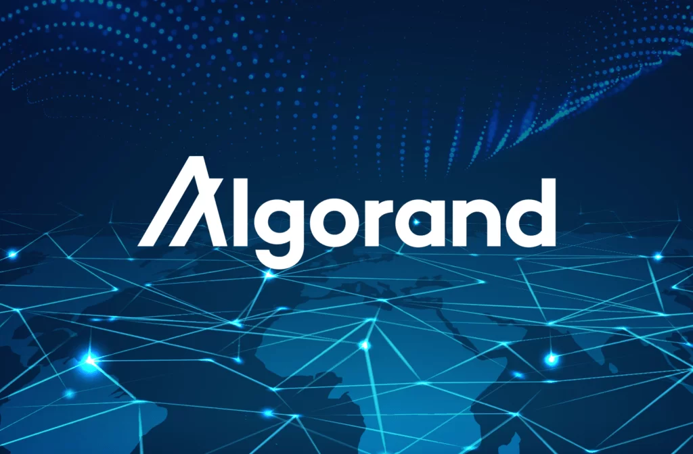

# End-to-End Web3 dApp
## Algorand 



<!-- Table of contents -->
- [Introduction](#Introduction)
- [Objectives](#objectives)
- [Requirements](#requirements)
- [Usage](#usage)
  - [Docker-compose](#docker-compose)
  - [Install-Sandbox](#Install-Sandbox)
  - [Install-SDK](#Install-SDK)
- [Contrbutor](#contrbutor)

## Introduction to Business Idea


10 Academy would like to solve the challenge of ensuring that certificates are available to all trainees in a secure way, and that certificate holders can benefit from smart contract actions now and in the future.  At present, certificates are distributed as simple PDF files, and without the ability to verify their neither authenticity nor can 10 Academy undertake smart actions with the trainees/their contracts. 

## Objectives
The objective of this project is to build end-to-end Web3 dapps on the Algorand Blockchain that help 10 Academy generate and distribute Non-Fungible Tokens (NFTs) as certificates that represents the successful completion of a weekly challenge to trainees, and allow trainees with NFTs to interact with a smart contract to perform pre-defined actions. In particular this is our objectives of this project.

## Requirements
The project requires the following:
pyteal
py-algorand-sdk
docker
docker-compose
pytest

## Usage
### Docker-compose
All of the project depebdecies are installed using docker-compose. The docker-compose file is located in the root directory.

### Install-Sandbox

To install and use this instance, follow these instructions.​

```bash
git clone https://github.com/algorand/sandbox.git
cd sandbox
./sandbox up testnet
```

### Install-SDK

To install the Python SDK, open a terminal and run the following command:​

```
pip3 install py-algorand-sdk
```
### To run the project

```
git cone https://github.com/tigisthailay/certificate_distrbution_and_smart_contract.git
cd certificate_distrbution_and_smart_contract
node server.js or npm start

```

## Contrbutor
- Tegisty Hailay


